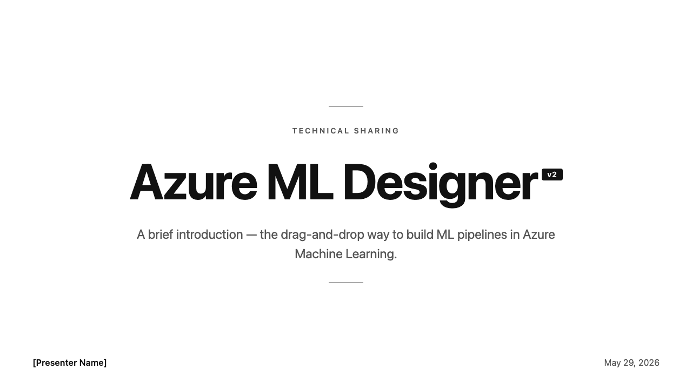
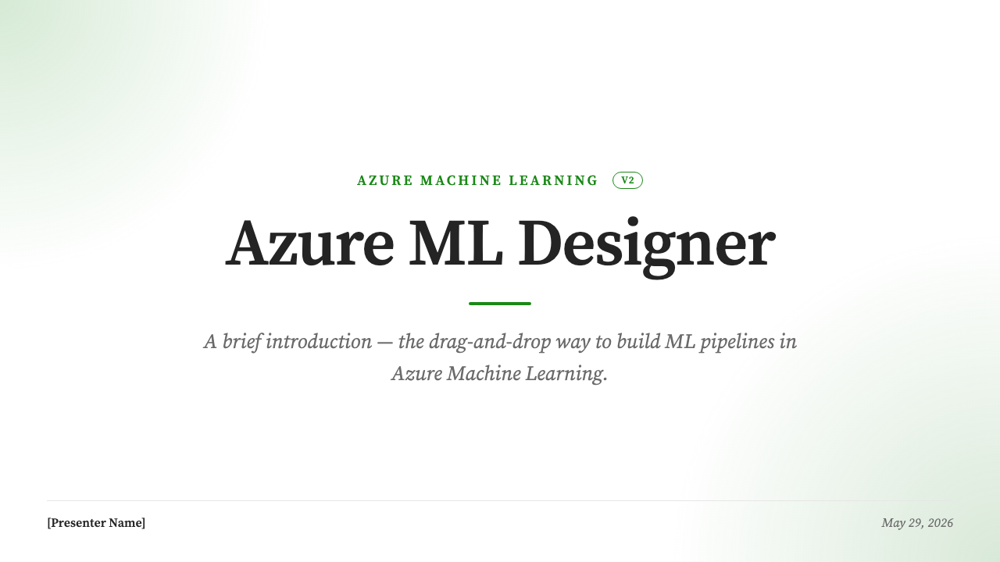
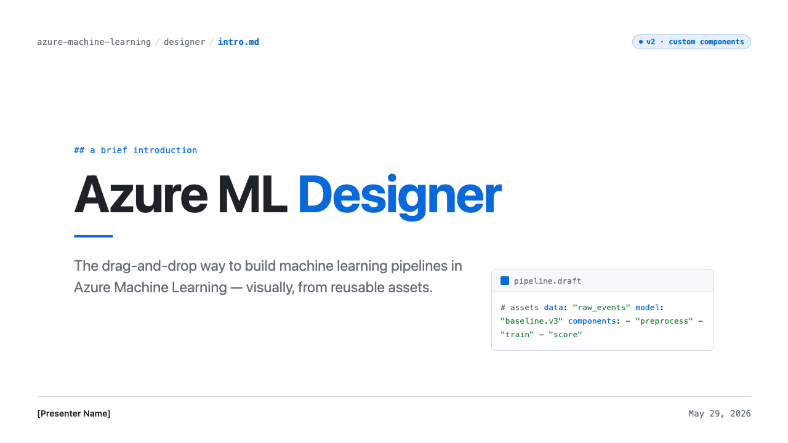
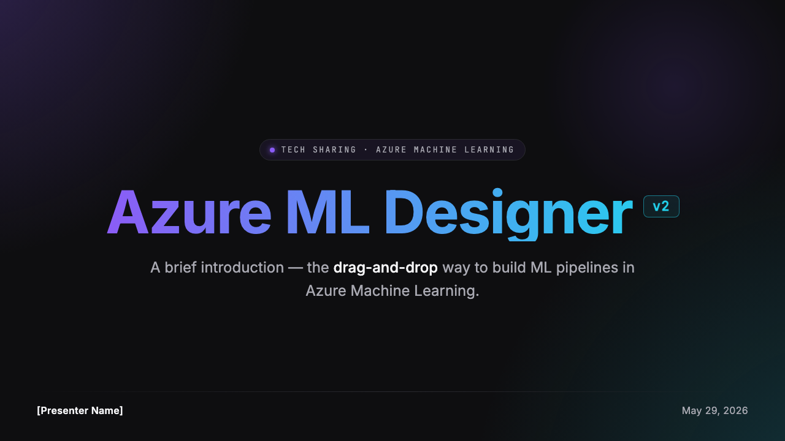
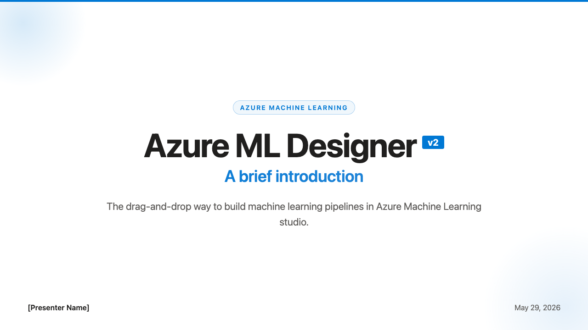
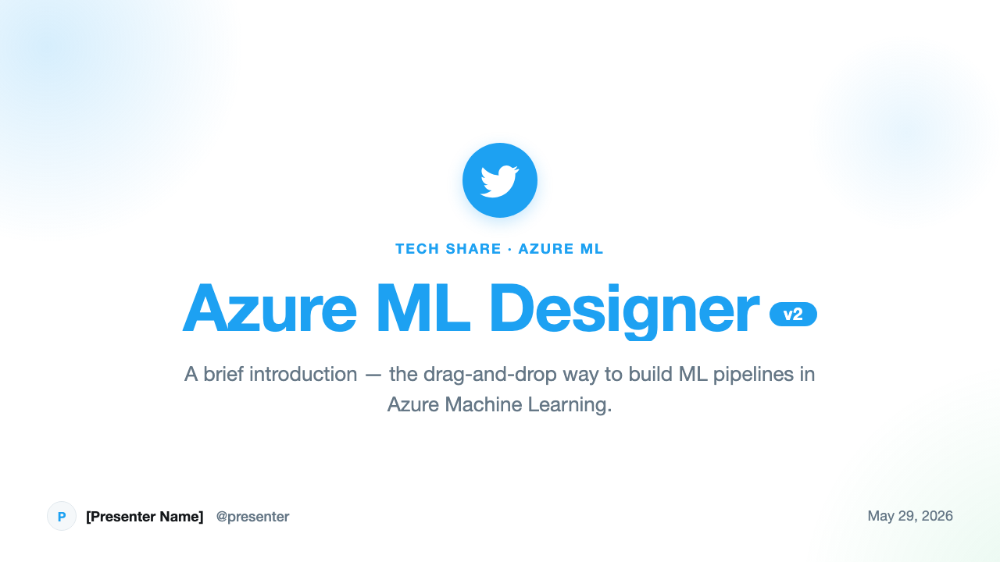
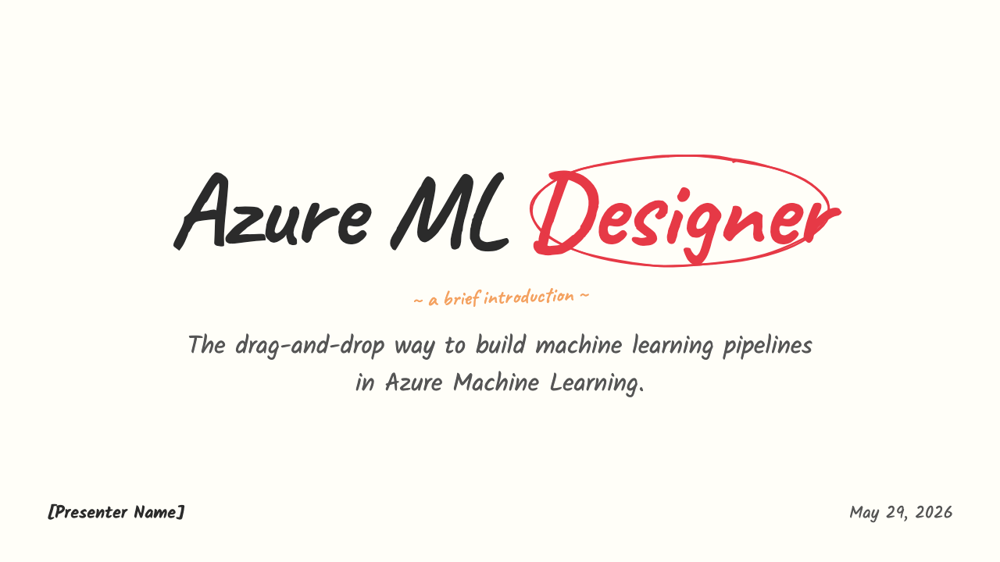
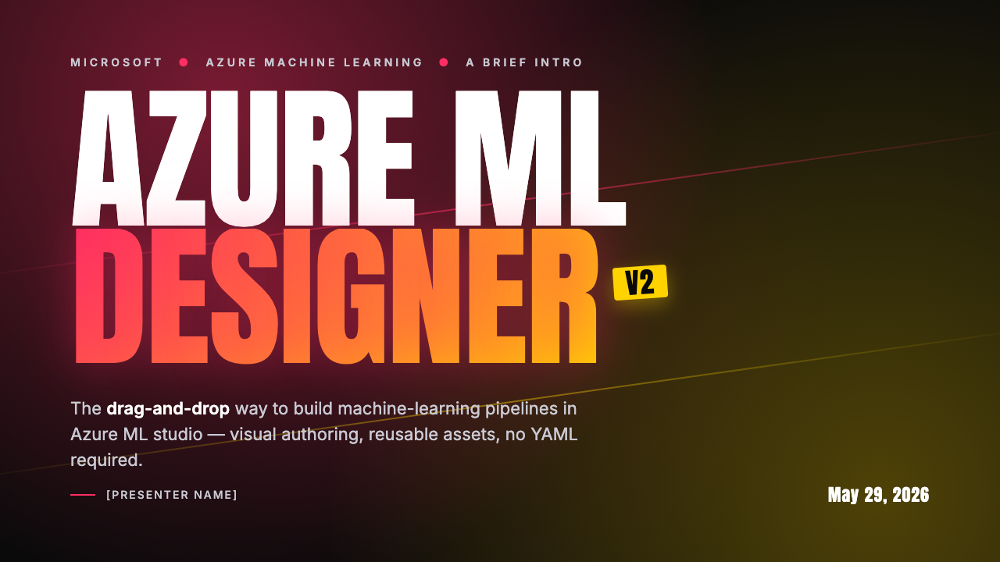

# Agent Skills

A collection of reusable skills for AI coding agents (Claude Code, Codex, Copilot, etc.). Each skill is a self-contained package that extends an agent's capabilities with specialized workflows, domain knowledge, and bundled resources.

## Skills

### [deck](https://github.com/iuiaoin/agent-skills/tree/main/skills/deck)

HTML presentation deck generator with a strict two-stage workflow:

- **`/deck --plan <prompt>`** — From a basic prompt, run a quick guided Q&A and synthesize a structured deck brief (using your prompt and any materials in `resources/`), confirm it, then expand it into a slide-by-slide outline saved to `PLANNING.md`
- **`/deck --generate`** — Pick a visual theme (10 built-in), then generate standalone HTML slides (1280x720, 16:9) from the approved plan, with a built-in presentation viewer that adopts the same theme — then automatically screenshot every slide and fix any overflow or broken-layout issues before opening

Themes — at the start of generation you choose one of 10 built-in themes; every slide and the viewer adopt its palette, fonts, and decoration. The same deck rendered in each (cover slide):

| | |
|:---:|:---:|
| <br>**`claude`** | <br>**`classic`** |
| <br>**`medium`** | <br>**`github`** |
| <br>**`dark`** | <br>**`google`** |
| <br>**`microsoft`** | <br>**`twitter`** |
| <br>**`hand-writing`** · [rough.js](https://github.com/rough-stuff/rough) | <br>**`artist`** |

Bonus:

- **`/deck --qa [--scale N]`** — Re-run the visual QA loop on already-generated slides (screenshot each slide via headless Chromium, detect overflow/layout problems, fix the HTML, re-check until clean) — useful after manual edits
- **`/deck --export pptx [--scale N]`** — Export generated slides to a PPTX file (renders each slide as a high-quality image via headless Chromium, default 3x resolution)

Supports technical sharing talks, architecture reviews, strategy decks, research summaries, pitch decks, and team updates. Outputs pure HTML/CSS/JS with no build tools required.

📎 [Sample repo](https://github.com/iuiaoin/deck-transformer) · [Live demo](https://iuiaoin.github.io/deck-transformer/)

## Skill Structure

Each skill follows a standard layout:

```
skill-name/
├── SKILL.md              # Instructions and metadata (required)
├── scripts/              # Executable code for deterministic tasks
├── references/           # Documentation loaded into context as needed
└── assets/               # Files used in output (templates, images, etc.)
```

## Installation

To use a skill, copy the skill directory into your `skills/`, taking the deck skill as an example:

**Claude Code**

```bash
cp -r skills/deck ~/.claude/skills/deck
```

**Codex Cli and others**

```bash
cp -r skills/deck ~/.agents/skills/deck
```
